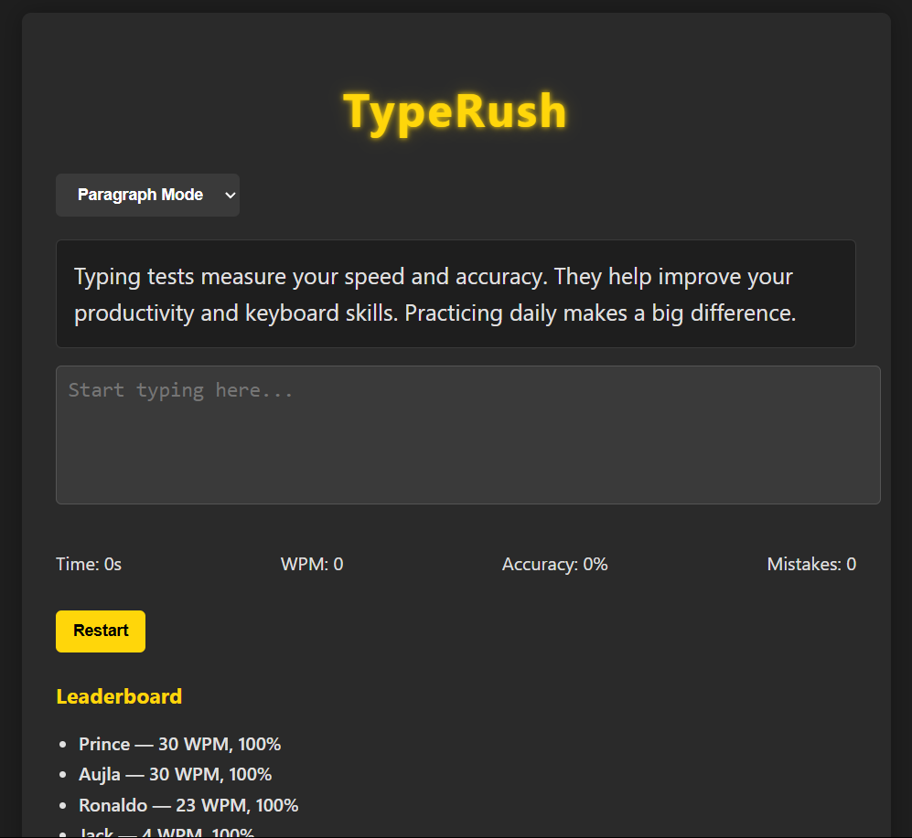

# TypeRush 🗲

TypeRush is a fun and fast typing speed test app made with HTML, CSS, and JavaScript.  
Includes WPM tracking, mistake counting, leaderboard, and responsive design.

## Features
- Real-time WPM & accuracy calculation
- WPM and accuracy calculation
- Responsive UI & dark theme
- MonkeyType-inspired vibe

## Screenshots

## Try
🔗 [Try it Live](https://princesingh05.github.io/TypeRush/)

## Built with
- HTML
- CSS
- JavaScript

